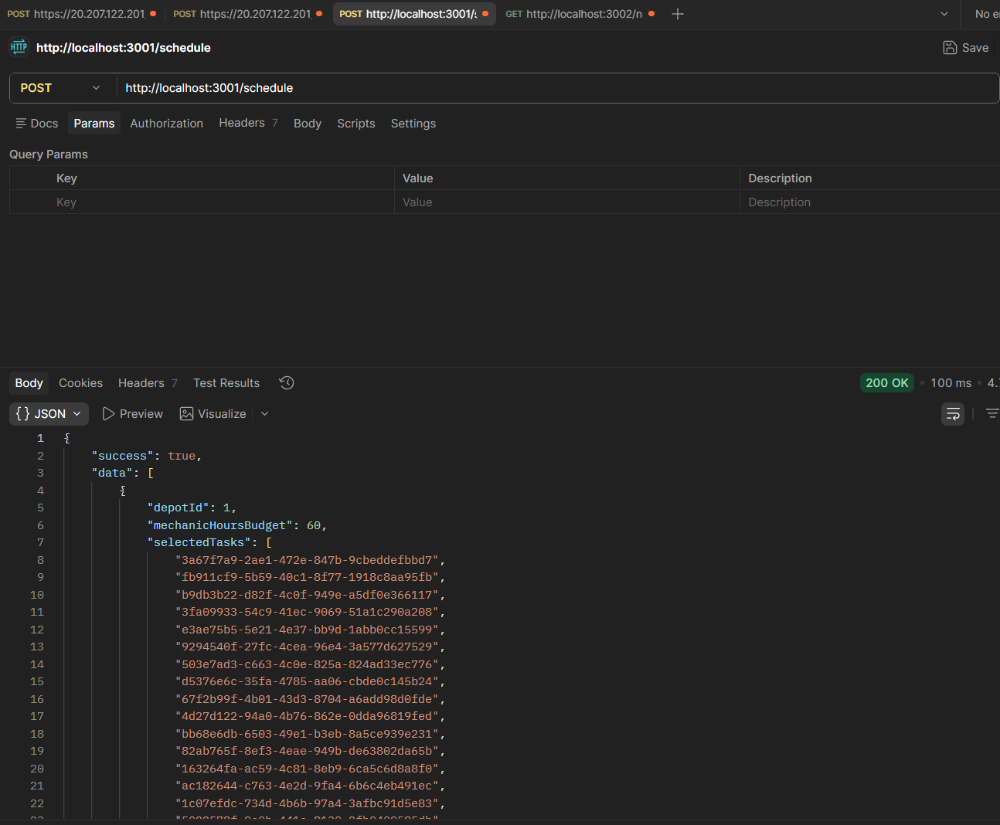
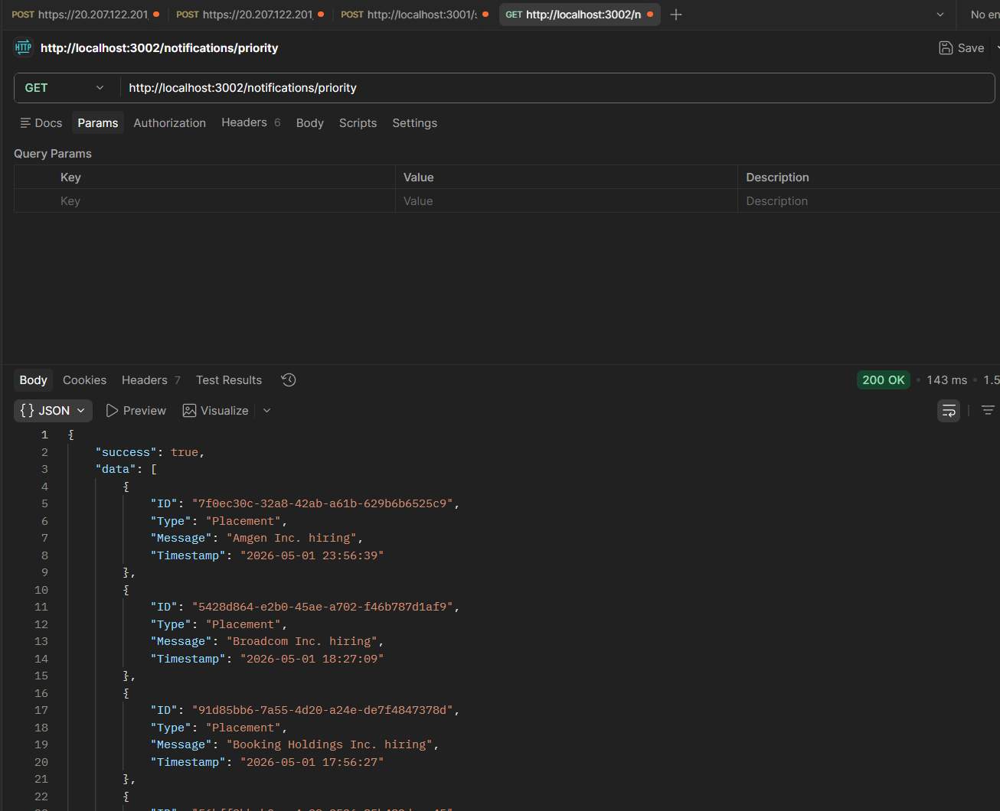

# 🚀 Backend Evaluation Submission

This repository contains my submission for the Backend Track of the Campus Hiring Evaluation. The project focuses on building clean, efficient, and scalable backend services while following real-world practices such as modular design, structured logging, secure API handling, and optimized algorithms.

---

## 📁 Project Structure

```
RA2311003030080/
│
├── logging_middleware/              # Centralized logging module
├── vehicle_maintenance_scheduler/  # Knapsack-based scheduling API
├── notification_app_be/            # Priority notification API
│
├── screenshots/                    # API testing screenshots
│   ├── schedule_api.png
│   ├── notification_priority.png
│
├── auth.js                         # Authentication script
├── test_log.js                     # Logging validation utility
├── package.json
├── .gitignore
└── README.md
```

---

## 🔐 Authentication & Authorization

All external API calls are secured using **Bearer Token Authentication**.

* Credentials are generated using the provided register and auth APIs.
* The token is stored securely in a `.env` file.
* Every request dynamically includes:

```
Authorization: Bearer <token>
```

No credentials are hardcoded anywhere in the codebase.

---

## 🧩 Logging Middleware

A reusable logging system is implemented in `logging_middleware`.

### Key Features:

* Function: `Log(stack, level, package, message)`
* Strict validation of:

  * Stack → `backend`, `frontend`
  * Level → `debug`, `info`, `warn`, `error`, `fatal`
  * Package → `controller`, `service`, `handler`, `route`, etc.
* Sends logs to the external logging API
* Non-blocking (logging failures do not interrupt execution)
* Short and meaningful log messages for better observability

The middleware is integrated across all layers (routes, services, controllers).

---

## 🚗 Vehicle Maintenance Scheduler

### Endpoint:

```
POST /schedule
```

### Description:

This service generates an optimized maintenance schedule for each depot.

### Approach:

* Fetch depots and vehicles from external APIs
* For each depot:

  * Maximize **Impact**
  * Ensure total **Duration ≤ Mechanic Hours**
* Uses a **space-optimized 0/1 Knapsack algorithm**

### Complexity:

* Time: `O(n × capacity)`
* Space: `O(capacity)`

### Sample Response:

```json
{
  "success": true,
  "data": [
    {
      "depotId": 1,
      "mechanicHoursBudget": 60,
      "selectedTasks": ["task1", "task2"],
      "totalImpact": 120,
      "totalDuration": 60
    }
  ]
}
```

---

## 🔔 Notification Priority API

### Endpoint:

```
GET /notifications/priority
```

### Description:

Returns the **top 10 most important notifications** based on priority and recency.

### Logic:

* Priority order:

  * Placement > Result > Event
* Tie-breaker:

  * Latest timestamp first

### Optimization:

* Uses a **Min-Heap (size 10)**
* Time Complexity: `O(N log K)`
* Efficient for large datasets

---

## ⚙️ Error Handling & Reliability

* All endpoints use `try-catch`
* Proper HTTP status codes:

  * `200` → success
  * `400` → client error
  * `500` → server error
* External API failures are handled gracefully
* Logging captures errors without breaking execution

---

## 🧪 Testing

All APIs were tested using Postman.

Each screenshot includes:

* Request
* Response
* Response time

---

## 📸 API Screenshots

### Vehicle Scheduler API



### Notification Priority API



---

## 🚀 How to Run

From the root directory:

### Start Vehicle Scheduler

```bash
node vehicle_maintenance_scheduler/index.js
```

### Start Notification API

```bash
node notification_app_be/index.js
```

---

## 📎 Notes

* `.env` file is excluded for security
* `node_modules` is ignored via `.gitignore`
* All APIs require a valid Bearer token

---

## 📌 Key Highlights

* Clean modular architecture
* Efficient DSA implementation (Knapsack + Heap)
* Centralized authentication handling
* Production-style logging middleware
* No hardcoded data
* Fully aligned with evaluation constraints

---

## ✅ Submission Ready

This project strictly follows all evaluation requirements:

* Single repository and branch
* Proper folder structure
* Clean and maintainable code
* Fully tested APIs with proof (screenshots)

---

Thank you for reviewing this submission!
